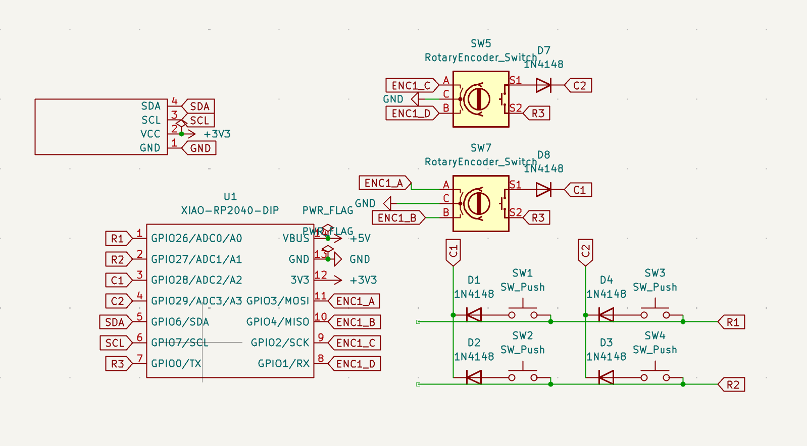
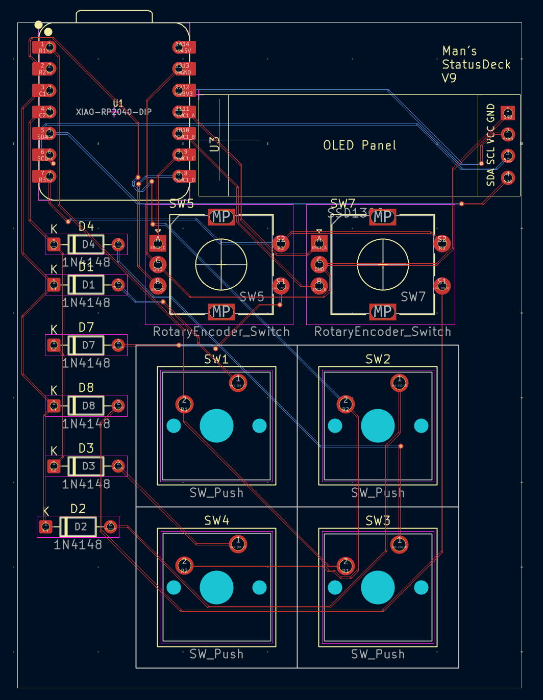
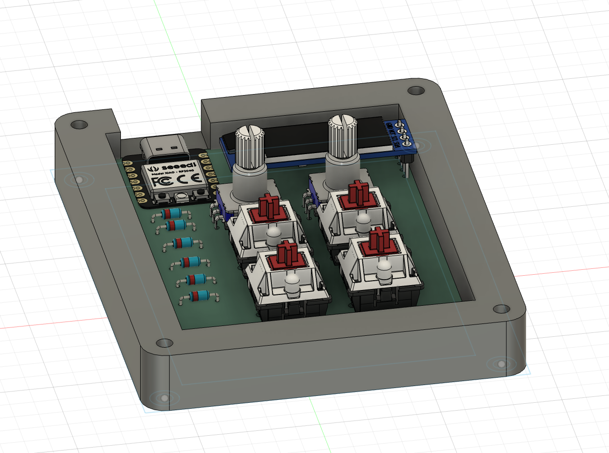

# Status_Deck_HackPad
Status_Deck is a fully custom-designed macro pad developed using the Seeed XIAO RP2040 microcontroller. The device incorporates a 2×3 diode-isolated key matrix, dual rotary encoders, and an I²C OLED display to provide real-time user feedback. The buttons are programmable to your needs, and this project was made for easy day-to-day use.

# Status_Deck

#Bill of Materials (BOM)

#| Item | Quantity | Description |

#| Seeed XIAO RP2040 | 1 | Microcontroller |

#| MX-style switches | 6 | Mechanical key switches |

#| 1N4148 Diodes | 6 | Matrix isolation |

#| Rotary Encoder | 2 | With push-button functionality |

#| 0.96" I²C OLED | 1 | SSD1306 display |

#| Keycaps | 6 | Compatible with MX switches |

#| Custom PCB | 1 | Designed in KiCad |

#| 3D Printed Case | 1 | Custom enclosure |

#| Screws / Standoffs | As needed | PCB mounting hardware |
